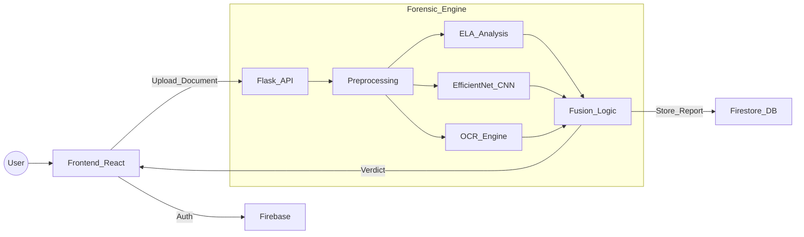

  
  
   
  
  # 🛡️ S I C A R I O
  
  **Next-Gen AI Document Forensic & Forgery Detection Platform**
  
  

    <b>Detect. Analyze. Verify.</b>  
    Unveiling the truth behind digital documents using State-of-the-Art Deep Learning & Computer Vision.
  

  

    
    
    
    
    
    
  

  <a href="#-demo"><strong>View Demo</strong></a> · 
  <a href="#-installation--setup"><strong>Installation</strong></a> · 
  <a href="#-api-endpoints"><strong>API Docs</strong></a> · 
  <a href="https://github.com/yourusername/sicario/issues"><strong>Report Bug</strong></a>

---

## 📸 UI Showcase

> A sneak peek into the forensic laboratory.

  

---

## 🔍 Overview

**Sicario** is an AI-powered forensic toolkit designed to verify the authenticity of digital documents such as invoices, certificates, ID cards, and legal records.

In the era of AI-generated images and advanced Photoshop manipulation, Sicario provides multi-layer verification using:

- Computer Vision
- Deep Learning
- OCR Geometry Analysis
- Metadata Inspection

---

## ✨ Key Features

### 🧠 AI & Deep Learning
- EfficientNet-based deep feature extraction
- Texture & noise inconsistency detection
- CNN-based authenticity scoring

### 👀 Computer Vision
- Error Level Analysis (ELA)
- Region duplication detection (copy-move)
- Compression artifact visualization

### 📄 Geometric & OCR
- Text alignment consistency checks
- Font & spacing anomaly detection
- OCR-based structure validation

### ⚡ System
- Real-time processing
- Secure Firebase authentication
- History & report storage
- JSON forensic reports

---

## 🏗️ System Architecture

---
### Tech Stack
Frontend (The Face)
Tech	Description
React (Vite)	High performance UI
Tailwind CSS	Utility-first styling
Framer Motion	Animations
Zustand	State management
Backend (The Brain)
Tech	Description
Flask	REST API
TensorFlow	Deep learning
OpenCV	Image processing
Tesseract OCR	Text extraction
Firebase	Auth & storage

---

Export to Sheets

### 🚀 Installation & Setup
Follow these steps to set up the laboratory locally.

Prerequisites
Node.js (v16+)

Python (v3.8+)

Tesseract OCR (sudo apt install tesseract-ocr or Win installer)

1️⃣ Clone the Repository
Bash

git clone [[https://github.com/your-username/sicario.git](https://github.com/your-username/sicario.git](https://github.com/devlopingandroid/Sicario.git))
cd sicario
2️⃣ Backend Setup
Bash

cd backend
python -m venv venv
# Windows: venv\Scripts\activate
# Mac/Linux: source venv/bin/activate

pip install -r requirements.txt
python app.py
🔥 Server running at: http://localhost:5001

3️⃣ Frontend Setup
Bash

cd frontend
npm install
npm run dev
💻 Client running at: http://localhost:3000

### 🔌 API Endpoints
Method	Endpoint	Body	Description
POST	/api/analyze	file (FormData)	Uploads document and triggers ML pipeline. Returns analysis JSON.
GET	/api/result/:filename	-	Serves the generated heatmap images.
GET	/health	-	Checks if the ML engine is ready.

Export to Sheets

 ### 👥 The Team

 <b>Built with ❤️ by Team Sicario</b>   <i>"Truth is hidden in the pixels."</i> 

